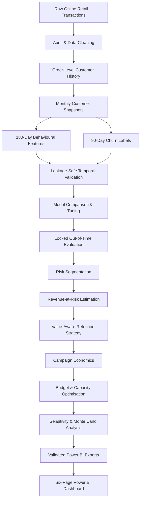

# E-commerce Churn & Retention Intelligence

[](https://www.python.org/)
[](https://scikit-learn.org/)
[](https://powerbi.microsoft.com/)
[](#)
[](LICENSE)
[](https://colab.research.google.com/github/AmlaanMohanty/E-commerce_churn_retention_intelligence/blob/main/notebooks/Ecommerce_Churn_Retention_Intelligence.ipynb)

An end-to-end **customer churn and retention intelligence project** that moves beyond churn prediction and converts machine-learning outputs into actionable business decisions.

The project combines **leakage-safe temporal modelling, revenue-at-risk estimation, value-aware customer prioritisation, retention strategy design, campaign economics, capacity-constrained budget allocation, Monte Carlo uncertainty analysis, and a six-page Power BI decision dashboard**.

> **Project status: Complete**  
> The Python analytics, machine-learning workflow, business optimisation layer, validated Power BI exports, and final Power BI dashboard are complete.

---

## Dashboard Preview

### Executive Overview


The Executive Overview provides a high-level view of customer churn exposure, customer value, revenue at risk, recommended campaign economics, and key retention indicators.

---

## Business Problem

Many churn projects stop after producing a churn probability or classification score.

This project goes further by answering four practical business questions:

1. **Which customers are most likely to stop purchasing within the next 90 days?**
2. **How much future customer value is exposed to that churn risk?**
3. **Which retention strategy is appropriate for each risk-value segment?**
4. **How should a limited campaign budget and operational capacity be allocated?**

The result is a decision-support workflow that connects predictive modelling directly to retention actions, campaign economics, and business prioritisation.

---

## Key Project Results

| KPI | Result |
|---|---:|
| Customers scored | **2,768** |
| Estimated 90-day customer value | **£1,743,419.59** |
| Probability-weighted revenue at risk | **£392,464.26** |
| Economically recommended customers | **2,449** |
| Estimated campaign cost | **£7,307.00** |
| Expected preserved revenue | **£25,308.46** |
| Expected net benefit | **£18,001.46** |
| Expected portfolio ROI | **246.36%** |
| Primary campaign customers | **1,250** |
| Primary campaign spend | **£2,498.00** |
| Primary campaign expected net benefit | **£12,920.79** |
| Primary campaign expected ROI | **517.25%** |
| Break-even effectiveness | **16.20%** |

---

## Final Model Performance

| Metric | Result |
|---|---:|
| ROC-AUC | **77.3%** |
| PR-AUC | **68.3%** |
| Accuracy | **64.8%** |
| Balanced accuracy | **68.1%** |
| Precision | **54.9%** |
| Recall | **88.1%** |
| F1 score | **67.7%** |
| Brier score | **0.197** |
| Recall at top 20% | **35.8%** |
| Lift at top 20% | **1.789×** |

The selected decision threshold intentionally favours recall so that fewer high-risk customers are missed.

---

# Power BI Dashboard

The final Power BI dashboard contains **six analytical pages**, designed to move from executive decision-making to model validation.

## 1. Executive Overview


Provides an executive-level summary of:

- customers scored;
- estimated customer value;
- probability-weighted revenue at risk;
- recommended campaign economics;
- expected ROI;
- risk concentration;
- retention strategy mix;
- high-level decision-support indicators.

---

## 2. Customer Risk


Focuses on the distribution and financial implications of churn risk.

Key analysis includes:

- customer distribution by risk tier;
- observed churn rate by tier;
- average predicted churn probability;
- revenue at risk;
- customer-value concentration;
- identification of higher-risk customer groups.

---

## 3. Retention Strategy


Transforms churn probabilities and estimated customer value into actionable retention strategies.

Customers are assigned to:

- **Rescue Now**
- **Protect High Value**
- **Reactivate Efficiently**
- **Nurture / Monitor**

The page links predicted risk to business value and recommended intervention intensity.

---

## 4. Campaign Economics


Evaluates whether recommended retention actions are economically attractive.

The analysis includes:

- expected campaign cost;
- expected preserved revenue;
- expected net benefit;
- portfolio ROI;
- campaign-channel economics;
- customer-level economic prioritisation.

> Campaign economics are assumption-based planning scenarios and should not be interpreted as experimentally measured causal uplift.

---

## 5. Budget & Sensitivity


Evaluates how campaign performance changes under budget, operational-capacity, and effectiveness uncertainty.

The page includes:

- capacity-constrained customer allocation;
- campaign budget optimisation;
- conservative, base, and optimistic scenarios;
- break-even effectiveness;
- Monte Carlo simulation;
- expected net-benefit ranges.

---

## 6. Model Performance


Provides model-quality and validation transparency.

The page includes:

- ROC-AUC;
- PR-AUC;
- recall;
- precision;
- F1 score;
- lift at top 20%;
- classification performance profile;
- model configuration and validation context;
- actual versus predicted churn across risk tiers.

The final model is a **Tuned Logistic Regression** using a **Drift-Robust Feature Set** with **44 features** and a decision threshold of approximately **41.4%**.

---

## Dashboard Files

The final Power BI deliverables are available here:

- [Download / View Power BI Dashboard (.pbix)](dashboard/Ecommerce_Churn_Retention_Intelligence_Dashboard.pbix)
- [View Dashboard PDF](dashboard/Ecommerce_Churn_Retention_Intelligence_Dashboard.pdf)

> Power BI Desktop is required to open the `.pbix` file.  
> The PDF and screenshots provide a platform-independent preview of the dashboard.

---

# Business Objective

The objective is to predict whether an eligible customer will make another merchandise purchase during the **90 days following each monthly snapshot**.

Predictions are combined with estimated 90-day customer value to prioritise retention actions according to both:

- predicted churn risk; and
- commercial exposure.

### Target Definition

- **Observation window:** Previous 180 days
- **Prediction horizon:** Following 90 days
- **Target:** `churn_90d = 1` when no qualifying merchandise purchase occurs within the outcome window
- **Modelling unit:** One customer at one monthly snapshot
- **Snapshot cadence:** Monthly

This design avoids treating inactivity as a timeless label and evaluates customer behaviour using only information available at each historical decision point.

---

# Dataset

The project uses the [UCI Online Retail II dataset](https://archive.ics.uci.edu/dataset/502/online%2Bretail%2Bii), containing transactions from a UK-based non-store online retailer.

| Item | Value |
|---|---:|
| Raw transaction rows | 1,067,371 |
| Raw date range | 1 Dec 2009 – 9 Dec 2011 |
| Workbook worksheets | 2 |
| Clean merchandise rows | 790,704 |
| Merchandise invoices | 36,594 |
| Customers with merchandise purchases | 5,852 |
| Merchandise revenue | £17,376,884.84 |

The raw workbook is **not stored in this repository**.

Dataset source and reproduction instructions are documented in:

[`data/README.md`](data/README.md)

---

# Analytical Workflow



---

# Data Preparation

The data-preparation workflow:

- combines both workbook periods into one consistent transaction table;
- removes exact duplicate records;
- removes anonymous transactions that cannot be associated with customers;
- separates sales, cancellations, and non-sale records;
- excludes postage, adjustments, discounts, bank charges, and other non-merchandise entries;
- aggregates transactional rows into order-level customer histories;
- preserves customer, time, country, units, products, and revenue information;
- performs validation checks following major transformations.

---

# Feature Engineering

The churn model uses information available **on or before each historical snapshot**.

Features include:

- purchase recency;
- purchase frequency;
- historical revenue;
- customer tenure;
- 30-, 60-, 90-, and 180-day activity;
- order momentum;
- revenue momentum;
- purchase-cycle gaps;
- purchase-cycle variability;
- customer lateness;
- overdue-purchase indicators;
- product diversity;
- order composition;
- cancellation behaviour;
- customer country;
- missing-history indicators.

The final drift-robust model uses **44 features** after removing redundant and unstable predictors.

---

# Leakage-Safe Validation

A random train-test split would create temporal leakage because the same customer can appear across multiple monthly snapshots.

The project therefore uses chronological development periods with **90-day purge gaps**, ensuring that training outcome windows end before later evaluation periods begin.

| Period | Snapshot months | Rows | Unique customers | Churn rate |
|---|---|---:|---:|---:|
| Training | Jun–Dec 2010 | 20,584 | 4,225 | 48.26% |
| Validation | Mar–May 2011 | 9,684 | 3,748 | 55.41% |
| Final out-of-time test | Aug–Sep 2011 | 5,534 | 2,968 | 41.81% |

The complete modelling table contains:

- **47,933 customer-snapshot rows**
- **5,212 customers**
- **16 monthly snapshots**

---

# Model Development

The project compares:

- no-skill baselines;
- logistic regression;
- random forest;
- histogram gradient boosting;
- full and drift-robust feature sets;
- tuned candidates evaluated using purged rolling cross-validation.

The final model was locked before examining the test data.

| Component | Final Choice |
|---|---|
| Model | Tuned Logistic Regression |
| Feature set | Drift-Robust Feature Set |
| Feature count | 44 |
| Decision threshold | 0.414 |
| Threshold policy | Validation threshold targeting at least 80% recall |

The logistic model was selected because of its:

- validation discrimination;
- stability;
- computational efficiency;
- interpretability.

---

# Final Out-of-Time Test Performance

| Metric | Result |
|---|---:|
| ROC-AUC | **0.773** |
| PR-AUC | **0.683** |
| Accuracy | 0.648 |
| Balanced accuracy | 0.681 |
| Precision | 0.549 |
| Recall | **0.881** |
| F1 score | 0.677 |
| Brier score | 0.197 |
| Recall at top 20% | 0.358 |
| Lift at top 20% | **1.789×** |

### Confusion Matrix

|  | Predicted retained | Predicted churn |
|---|---:|---:|
| Actual retained | 1,547 | 1,673 |
| Actual churn | 276 | 2,038 |

The decision threshold identifies **88.1% of observed churners**, deliberately accepting additional false positives in exchange for missing fewer genuinely at-risk customers.

---

# Model Explainability

Coefficient analysis and validation permutation importance identify several influential behavioural signals, including:

- `activity_span_180d`
- `active_days_90d`
- `lifetime_orders`
- `recency_days`
- `days_over_expected_purchase`
- purchase-gap measures
- purchase-cycle variability measures

The overall interpretation is consistent:

> Customers with weakening or shorter activity histories, increasing recency, irregular purchasing cycles, and overdue purchases tend to exhibit greater future churn risk.

---

# Operational Risk & Revenue Exposure

The operational snapshot used for decision support contains **2,768 customers**.

| KPI | Result |
|---|---:|
| Estimated 90-day customer value | £1,743,419.59 |
| Probability-weighted revenue at risk | **£392,464.26** |

## Risk Tiers

| Risk Tier | Customers | Customer Share | Observed Churn Rate | Average Predicted Risk |
|---|---:|---:|---:|---:|
| Low | 1,383 | 49.96% | 19.88% | 30.06% |
| Medium | 831 | 30.02% | 50.42% | 62.20% |
| High | 277 | 10.01% | 64.98% | 74.85% |
| Critical | 277 | 10.01% | 77.26% | 83.77% |

Observed churn rises consistently from **Low → Medium → High → Critical**, showing that the risk segmentation meaningfully orders customers according to future churn behaviour.

---

# Value-Aware Retention Strategy

Risk alone is not sufficient to determine retention investment.

Customers are therefore segmented using both:

- predicted churn probability; and
- estimated 90-day customer value.

### Segmentation Boundaries

- **High-risk boundary:** Top 20% of predicted risk
- **Risk probability cutoff:** approximately **0.714**
- **High-value boundary:** Top 20% of estimated customer value
- **Customer-value cutoff:** approximately **£685.30**

| Strategy | Customers | Purpose |
|---|---:|---|
| Rescue Now | 9 | High-risk, high-value customers requiring personal intervention |
| Protect High Value | 545 | Valuable customers suited to loyalty or VIP treatment |
| Reactivate Efficiently | 545 | Higher-risk customers suited to scalable targeted campaigns |
| Nurture / Monitor | 1,669 | Lower-intensity digital nurture and monitoring |

---

# Campaign Economics

The project translates churn risk into a business-planning scenario.

These estimates are **assumption-based planning values rather than experimentally measured causal uplift**.

| Planning KPI | Result |
|---|---:|
| Economically recommended customers | 2,449 |
| Estimated campaign cost | £7,307.00 |
| Expected preserved revenue | £25,308.46 |
| Expected net benefit | **£18,001.46** |
| Expected portfolio ROI | **246.36%** |

---

# Capacity-Constrained Campaign Allocation

When budget and operational capacity are constrained, the optimisation workflow:

1. protects mandatory `Rescue Now` customers;
2. respects strategy-level operational capacities;
3. considers economically viable customers;
4. ranks eligible customers using expected economic benefit;
5. allocates campaign resources without exceeding the available budget.

### £2,500 Primary Campaign Scenario

| KPI | Result |
|---|---:|
| Selected customers | **1,250** |
| Expected spend | **£2,498.00** |
| Expected preserved revenue | **£15,418.79** |
| Expected net benefit | **£12,920.79** |
| Expected ROI | **517.25%** |

---

# Sensitivity & Monte Carlo Analysis

Because campaign effectiveness cannot be known with certainty before execution, the project evaluates multiple scenarios.

| Scenario | Expected Net Benefit |
|---|---:|
| Conservative | £5,211.40 |
| Base | £12,920.79 |
| Optimistic | £20,630.19 |

A **20,000-run Monte Carlo simulation** produces:

- **5th percentile net benefit:** £9,695.63
- **Median net benefit:** £13,717.27
- **95th percentile net benefit:** £17,981.56
- **Break-even effectiveness:** 16.20% of the base assumptions

The simulated probability of positive net benefit is **100% within the specified uncertainty ranges**.

This result is conditional on the modelling assumptions and should not be interpreted as proof of causal campaign uplift.

---

# Power BI Data Pipeline

The Python workflow exports validated datasets specifically designed for Power BI.

Exports include:

- executive KPIs;
- model performance;
- customer-level risk scores;
- primary campaign targets;
- risk-tier summaries;
- retention-strategy summaries;
- campaign economics;
- campaign assumptions;
- budget scenarios;
- capacity allocation;
- sensitivity scenarios;
- Monte Carlo results;
- validation results;
- data dictionary.

See:

[`outputs/README.md`](outputs/README.md)

for details of the Power BI-ready analytical exports.

---

# Repository Structure

```text
.
├── data/
│   └── README.md
│
├── notebooks/
│   ├── README.md
│   └── Ecommerce_Churn_Retention_Intelligence.ipynb
│
├── outputs/
│   ├── 01_executive_kpis.csv
│   ├── 02_model_performance.csv
│   ├── 03_customer_risk_scores.csv
│   ├── 04_primary_campaign_targets.csv
│   ├── ...
│   └── README.txt
│
├── dashboard/
│   ├── Ecommerce_Churn_Retention_Intelligence_Dashboard.pbix
│   ├── Ecommerce_Churn_Retention_Intelligence_Dashboard.pdf
│   │
│   └── screenshots/
│       ├── 01_Executive_Overview.png
│       ├── 02_Customer_Risk.png
│       ├── 03_Retention_Strategy.png
│       ├── 04_Campaign_Economics.png
│       ├── 05_Budget_Sensitivity.png
│       └── 06_Model_Performance.png
│
├── .gitignore
├── LICENSE
├── README.md
└── requirements.txt
```

---

# Technologies Used

### Data & Machine Learning

- Python
- pandas
- NumPy
- scikit-learn

### Analysis & Visualisation

- Matplotlib
- Seaborn
- Jupyter Notebook
- Google Colab

### Business Intelligence

- Microsoft Power BI
- Power Query
- DAX

### Version Control

- Git
- GitHub

---

# How to Reproduce the Project

## Option 1 — Google Colab

Use the **Open in Colab** badge at the top of this README.

Then run the notebook sequentially from beginning to end.

The notebook contains the dataset preparation, validation, modelling, campaign optimisation, uncertainty analysis, and export pipeline.

---

## Option 2 — Local Environment

Clone the repository:

```bash
git clone https://github.com/AmlaanMohanty/E-commerce_churn_retention_intelligence.git
cd E-commerce_churn_retention_intelligence
```

Create a Python virtual environment:

```bash
python -m venv .venv
```

### macOS / Linux

```bash
source .venv/bin/activate
```

### Windows

```powershell
.venv\Scripts\activate
```

Install the required packages:

```bash
pip install -r requirements.txt
```

Launch Jupyter:

```bash
jupyter notebook notebooks/Ecommerce_Churn_Retention_Intelligence.ipynb
```

Run the notebook from top to bottom so that all intermediate tables, modelling objects, validations, and Power BI exports are generated in sequence.

---

# Validation & Quality Controls

The analytical workflow includes automated validation for:

- duplicate records;
- missing customer identifiers;
- invalid sales;
- invalid quantities;
- invalid prices;
- invalid revenue values;
- feature leakage;
- target leakage;
- chronological split integrity;
- purged prediction windows;
- non-finite model features;
- impossible feature values;
- redundant features;
- feature drift;
- model availability;
- threshold availability;
- campaign-strategy assignment;
- campaign economics;
- budget constraints;
- operational capacity;
- reconciliation rules;
- final export completeness.

A dedicated validation output is also included in the Power BI data model.

---

# Limitations

- Churn is inferred from future purchasing inactivity rather than an explicit account-closure event.
- The dataset represents one retailer and a historical period, so model performance may not directly transfer to another organisation.
- Campaign risk-reduction, cost, preserved-revenue, ROI, and optimisation results depend on planning assumptions rather than controlled experiments.
- Customer value is an analytical estimate rather than a complete lifetime-value model.
- Country-level effects for small customer groups should be interpreted cautiously.
- Model probabilities should be monitored and recalibrated if customer behaviour changes over time.

A production deployment should additionally include:

- automated data pipelines;
- prediction monitoring;
- drift monitoring;
- periodic calibration review;
- privacy and governance controls;
- controlled retention experiments;
- causal uplift measurement.

---

# Project Highlights

This project demonstrates the ability to connect:

**Data Engineering → Feature Engineering → Machine Learning → Model Validation → Business Analytics → Customer Segmentation → Campaign Economics → Optimisation → Monte Carlo Analysis → Power BI → Executive Decision Support**

Rather than treating churn prediction as an isolated machine-learning exercise, the project converts model outputs into a complete business decision framework.

---

# Author

**Amlaan Mohanty**

[GitHub Profile](https://github.com/AmlaanMohanty)

---

# License

This project is licensed under the [MIT License](LICENSE).
