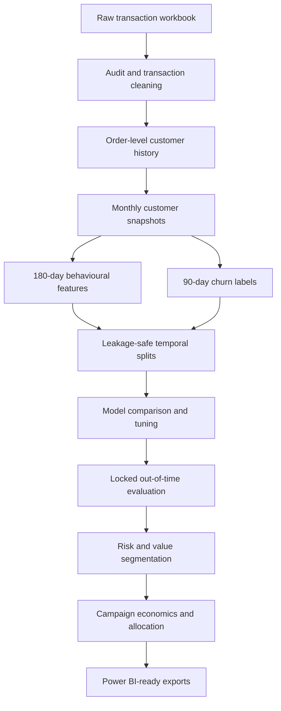

# E-commerce Churn & Retention Intelligence

[](https://www.python.org/)
[](https://scikit-learn.org/)
[](https://powerbi.microsoft.com/)
[](LICENSE)
[](https://colab.research.google.com/github/AmlaanMohanty/E-commerce_churn_retention_intelligence/blob/main/notebooks/Ecommerce_Churn_Retention_Intelligence.ipynb)

An end-to-end customer-retention intelligence project that moves beyond churn prediction. It combines leakage-safe temporal modelling, revenue-at-risk estimation, value-aware customer prioritisation, campaign economics, capacity-constrained budget allocation, uncertainty analysis, and Power BI-ready exports.

> **Project status:** The Python analytics and machine-learning workflow is complete. The Power BI dashboard is the next development phase.

## Why this project is different

Many churn projects stop after producing a probability or classification score. This project connects model output to business decisions by answering four practical questions:

1. Which customers are most likely to stop purchasing within the next 90 days?
2. How much future customer value is exposed to that risk?
3. Which retention action is appropriate for each risk-value segment?
4. How should a limited campaign budget and operational capacity be allocated?

The result is a decision-support workflow that translates predictive modelling into an actionable retention campaign plan.

## Business objective

The objective is to predict whether an eligible customer will make another merchandise purchase during the 90 days following each monthly snapshot. Predictions are then combined with estimated 90-day customer value to prioritise retention actions by both churn risk and commercial exposure.

### Target definition

- **Observation window:** Previous 180 days
- **Prediction horizon:** Following 90 days
- **Target:** `churn_90d = 1` when no qualifying merchandise purchase occurs within the outcome window
- **Modelling unit:** One customer at one monthly snapshot
- **Snapshot cadence:** Monthly

This design avoids treating inactivity as a timeless label and allows customer behaviour to be evaluated as it was known at each historical decision point.

## Dataset

The project uses the [UCI Online Retail II dataset](https://archive.ics.uci.edu/dataset/502/online%2Bretail%2Bii), containing transactions from a UK-based non-store online retailer.

| Item | Value |
|---|---:|
| Raw transaction rows | 1,067,371 |
| Raw date range | 1 Dec 2009 – 9 Dec 2011 |
| Workbook worksheets | 2 |
| Clean merchandise rows | 790,704 |
| Merchandise invoices | 36,594 |
| Customers with merchandise purchases | 5,852 |
| Merchandise revenue | £17,376,884.84 |

The raw workbook is not stored in this repository. Reproduction instructions and the official source are documented in [`data/README.md`](data/README.md).

## Analytical workflow



### Data preparation

- Combined the two workbook periods into one consistent transaction table.
- Removed exact duplicates and anonymous transactions that could not be linked to a customer.
- Separated valid sales, cancellations, and non-sale records.
- Excluded postage, manual adjustments, discounts, bank charges, and other non-merchandise codes from merchandise purchase history.
- Aggregated line items into order-level records while preserving customer, time, country, revenue, unit, and product information.
- Added explicit validation checks after each major transformation.

### Feature engineering

The model uses behavioural information available on or before each snapshot, including:

- purchase recency, frequency, revenue, and tenure;
- activity across 30-, 60-, 90-, and 180-day windows;
- recent order and revenue momentum;
- purchase-cycle gaps, variability, lateness, and overdue flags;
- product diversity and order composition;
- cancellation behaviour;
- customer country and missing-history indicators.

The final drift-robust model uses **44 raw features** after removing redundant and unstable predictors.

## Leakage-safe validation design

Random row splitting would leak temporal information because the same customer can appear in multiple monthly snapshots. This project instead uses chronological development periods with 90-day purge gaps so that training outcome windows end before later evaluation periods begin.

| Period | Snapshot months | Rows | Unique customers | Churn rate |
|---|---|---:|---:|---:|
| Training | Jun–Dec 2010 | 20,584 | 4,225 | 48.26% |
| Validation | Mar–May 2011 | 9,684 | 3,748 | 55.41% |
| Final out-of-time test | Aug–Sep 2011 | 5,534 | 2,968 | 41.81% |

In total, the modelling table contains **47,933 customer-snapshot rows**, represents **5,212 customers**, and spans **16 monthly snapshots**.

## Model development

The project compared:

- no-skill baselines;
- logistic regression;
- random forest;
- histogram gradient boosting;
- full and drift-robust feature sets;
- tuned candidates evaluated with purged rolling cross-validation.

The final model was locked before accessing the test data:

| Component | Final choice |
|---|---|
| Model | Tuned logistic regression |
| Feature set | Drift-robust feature set |
| Raw feature count | 44 |
| Decision threshold | 0.414 |
| Threshold policy | Validation threshold targeting at least 80% recall |

The logistic model was selected for its validation discrimination, stability, speed, and interpretability. The locked model and threshold were evaluated only once on the final out-of-time test period.

## Final out-of-time test performance

| Metric | Result |
|---|---:|
| ROC-AUC | **0.773** |
| PR-AUC | **0.683** |
| Accuracy | 0.648 |
| Balanced accuracy | 0.681 |
| Precision | 0.549 |
| Recall | **0.881** |
| F1 score | 0.677 |
| Brier score | 0.197 |
| Recall at top 20% | 0.358 |
| Lift at top 20% | **1.789×** |

### Test confusion matrix

|  | Predicted retained | Predicted churn |
|---|---:|---:|
| Actual retained | 1,547 | 1,673 |
| Actual churn | 276 | 2,038 |

The threshold intentionally favours recall: it identifies 88.1% of observed churners, accepting more false positives so that fewer at-risk customers are missed.

## Model explainability

Coefficient analysis and validation permutation importance indicate that the most influential behavioural signals include:

- `activity_span_180d`;
- `active_days_90d`;
- `lifetime_orders`;
- `recency_days`;
- `days_over_expected_purchase`;
- purchase-gap and cycle-variability measures.

These results support a consistent business interpretation: customers with shorter or weakening activity histories, longer recency, and overdue purchase cycles tend to show greater future churn risk.

## Operational risk and revenue exposure

The latest operational snapshot contains **2,768 customers**.

| KPI | Result |
|---|---:|
| Estimated 90-day customer value | £1,743,419.59 |
| Probability-weighted revenue at risk | **£392,464.26** |

### Risk tiers

| Risk tier | Customers | Customer share | Observed churn rate |
|---|---:|---:|---:|
| Low | 1,383 | 49.96% | 19.88% |
| Medium | 831 | 30.02% | 50.42% |
| High | 277 | 10.01% | 64.98% |
| Critical | 277 | 10.01% | 77.26% |

Observed churn increases monotonically across the four tiers, confirming that the segmentation meaningfully orders customers by risk.

## Value-aware retention strategy

Risk alone is not sufficient for allocating retention effort. Customers are therefore segmented using both predicted churn probability and estimated 90-day value.

- **High-risk boundary:** Top 20% of predicted risk, equivalent to a probability of 0.714
- **High-value boundary:** Top 20% of estimated customer value, equivalent to £685.30

| Strategy | Customers | Purpose |
|---|---:|---|
| Rescue Now | 9 | High-risk, high-value customers requiring personal intervention |
| Protect High Value | 545 | Valuable customers suited to proactive loyalty or VIP service |
| Reactivate Efficiently | 545 | Higher-risk customers suited to scalable targeted campaigns |
| Nurture / Monitor | 1,669 | Lower-intensity monitoring and digital nurture |

## Campaign economics

The notebook converts risk scores into an assumption-based campaign business case. These values are **planning scenarios, not measured causal uplift**.

| Planning KPI | Result |
|---|---:|
| Economically recommended customers | 2,449 |
| Estimated campaign cost | £7,307.00 |
| Expected preserved revenue | £25,308.46 |
| Expected net benefit | **£18,001.46** |
| Expected portfolio ROI | **246.36%** |

### Capacity-aware primary campaign

When campaign budget and channel capacity are constrained, the allocation process reserves specialist capacity for `Rescue Now` customers and then ranks remaining customers by expected net benefit per £1.

| KPI | £2,500 primary scenario |
|---|---:|
| Selected customers | 1,250 |
| Expected spend | £2,498.00 |
| Expected preserved revenue | £15,418.79 |
| Expected net benefit | **£12,920.79** |
| Expected ROI | **517.25%** |

### Sensitivity and uncertainty

| Scenario | Expected net benefit |
|---|---:|
| Conservative | £5,211.40 |
| Base | £12,920.79 |
| Optimistic | £20,630.19 |

A 20,000-run Monte Carlo simulation produced:

- 5th-percentile net benefit: **£9,695.63**;
- median net benefit: **£13,717.27**;
- 95th-percentile net benefit: **£17,981.56**;
- portfolio break-even effectiveness: **16.20% of the base assumptions**.

The simulated probability of positive net benefit is 100% **within the chosen uncertainty ranges**. This is conditional on the scenario assumptions and should not be interpreted as proof of campaign uplift.

## Power BI deliverables

The notebook exports 18 validated artifacts for dashboard development, including:

- executive KPIs;
- model performance;
- customer-level risk scores;
- primary campaign targets;
- risk-tier and retention-strategy summaries;
- campaign economics and assumptions;
- budget scenarios and capacity allocations;
- sensitivity and Monte Carlo summaries;
- validation results and a data dictionary.

See [`outputs/README.md`](outputs/README.md) for the export guide.

## Repository structure

```text
.
├── data/
│   └── README.md
├── notebooks/
│   ├── README.md
│   └── Ecommerce_Churn_Retention_Intelligence.ipynb
├── outputs/
│   ├── 01_executive_kpis.csv
│   ├── 02_model_performance.csv
│   ├── 03_customer_risk_scores.csv
│   ├── 04_primary_campaign_targets.csv
│   ├── ...
│   └── README.txt
├── .gitignore
├── LICENSE
├── README.md
└── requirements.txt
```

## Technologies used

- Python
- pandas and NumPy
- scikit-learn
- Matplotlib and Seaborn
- Jupyter / Google Colab
- Power BI
- Git and GitHub

## How to reproduce the project

### Option 1: Google Colab

Use the **Open in Colab** badge at the top of this README, then run the notebook in order. The notebook contains dataset setup and validation steps.

### Option 2: Local environment

```bash
git clone https://github.com/AmlaanMohanty/E-commerce_churn_retention_intelligence.git
cd E-commerce_churn_retention_intelligence

python -m venv .venv
source .venv/bin/activate
pip install -r requirements.txt

jupyter notebook notebooks/Ecommerce_Churn_Retention_Intelligence.ipynb
```

Windows activation command:

```powershell
.venv\Scripts\activate
```

Run the notebook from top to bottom so that all intermediate tables, models, validations, and export objects are created in sequence.

## Validation and quality controls

The workflow includes automated checks for:

- duplicates and missing identifiers;
- invalid sales, prices, quantities, and revenue;
- feature and target leakage;
- chronological split order and purged outcome windows;
- non-finite and impossible feature values;
- redundant features and validation drift;
- model, feature-set, and threshold availability;
- campaign assignment, budget, capacity, and reconciliation rules;
- final export completeness.

## Limitations

- Churn is inferred from future purchase inactivity rather than an explicit account-closure event.
- The data represents one retailer and an historical period, so performance may not transfer directly to another business.
- Campaign risk-reduction, cost, and ROI values are scenario assumptions rather than experimentally measured uplift.
- Customer value is an analytical estimate and not a full lifetime-value model.
- Country-level coefficients for small customer groups should be interpreted cautiously.

A production deployment should add live data pipelines, monitoring, calibration review, privacy controls, and controlled campaign experiments.

## Author

**Amlaan Mohanty**  
[GitHub profile](https://github.com/AmlaanMohanty)

## License

This project is licensed under the [MIT License](LICENSE).
